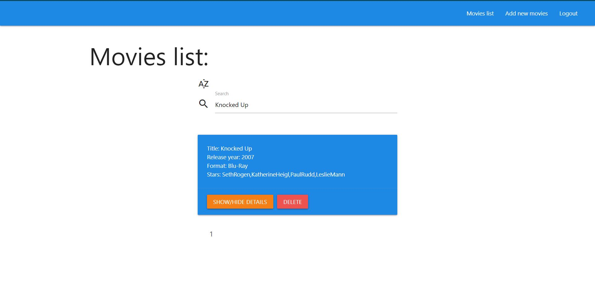

# movies-mern
Web application for storing information about movies

## How to run the application
#### Install packages
In the project root execute
```sh
npm install
cd client
npm install
```
#### Run application
In the project root execute
```sh
npm run dev
```

## Application architecture
The application is implemented on MERN Stack. MERN is the acronym for MongoDB, Express JS, React JS and Node JS. The MERN stack is a combination of the above technologies, all based on JavaScript, used to build advanced web applications.

#### Server 
User authorization is implemented using a jwt token and bcrypt hashing.
There are models for users and movies and their routes
#### Client
The client has pages for user authorization, a list of movies and a page for adding movies.
Requests are implemented using a custom http hook. Hooks are also used to display messages to the user and authorization. 
Page routing is implemented using the "react-router-dom" 

## User manual
1. On the authorization page, enter the email and password for registration and / or log in to the system

2. On the movies list page all movies are shown. You can show movie detail, delete, sort by name and search by name or by stars. No more than four movies are shown on one page. select another page on the pagination menu to go to it



3. On the add new movies page you can add movie by filling in a form or uploading from a file


## Contact

Vladyslav Tsymbalistuy - tsymbalistyi.vladislav@gmail.com
